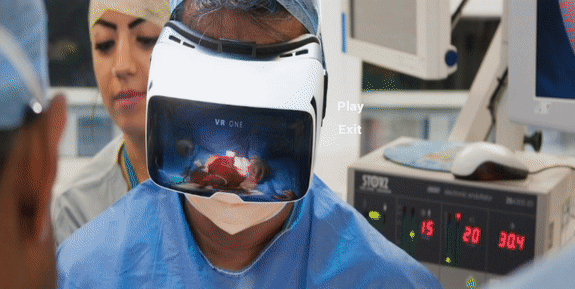
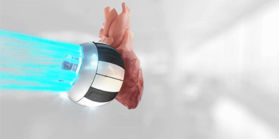
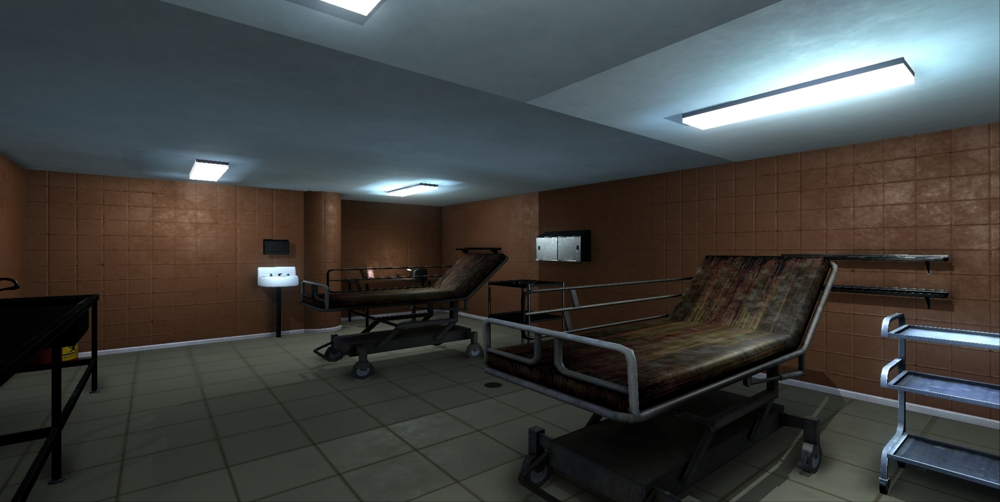

# VR-medical-learning-and-training

> Medical Trainees can learn life-saving techniques and skills using this simulation without risking any patient's life. As VR offers a realistic scenario, students could respond to high pressure situations and learn how to deal with it. 

> As a team lead, Implemented and Scripted user controls, interactive medical tools used in training. Designed UI for main menu, selection menu and switching between these menus. Implemented a technique to view a certain video in 360 degrees for VR. Also, Designed a hospital environment for simulation.

# Menu

> Simple UI menu for user to start and exit the simulation. Next menu includes two different approaches, the learning approach where users can learn about a particular body part with 360 immersive experience and next the training approach allowing user to interact with the patient and have a walkthrough of the hospital 

# Learning : functioning of Different body parts 

# Training and Walkthrough

> Users are able to interact with the hospital objects in the surrounding, can have a walkthrough of the hospital in 360 view by mounting a VR and can interact with the patients 

# Next Step

> Including hand gesture controls in VR connectivity allowing user to interact with the medical tool and perform different surgeries on patient. Also allowing user to give appropiate medication to the patients.

# Technologies

> C#, Unity3D, Blender, andriod sdk
